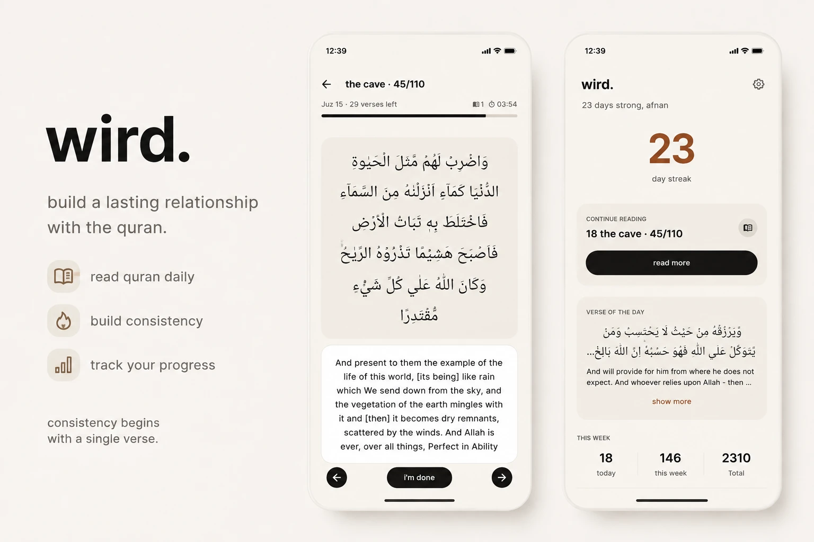

# wird



a quran reading app for one person: whoever's holding the phone.

## what is this

wird (ورد) is the arabic word for a person's regular, committed portion of quran recitation. the daily habit you keep, not the one you meant to start someday. that's the whole idea here: read a little, every day, and have something honest keep track of it for you.

it's a habit tracker wearing a quran app's clothes, or maybe the other way around. either way, there's no leaderboard, no notifications guilting you at 9pm, and nobody but you will ever see your streak.

## why build another quran app

because there are already a bunch of good ones, and this isn't trying to replace them. it's trying to be *mine*. i wanted a streak mechanic that didn't feel like it was designed to make me anxious, translations i could actually understand without a footnote, and a reading screen that doesn't make me feel like i'm filling out a form.

if this feels inspired by the gamified habit apps you already know, it is. i just wanted that energy pointed at something that actually matters to me.

## what it actually does

- reads the quran, arabic text alongside two english translations (saheeh international, and the clear quran for when the literal translation isn't clicking)
- tracks a daily streak with a grace day built in, because missing one day shouldn't erase everything you built
- shows real progress: how much of the quran you've actually read, not just how many times you tapped a page
- lets you jump into any surah or juz without messing up where you were actually reading
- keeps a running total of time spent reading, across every session, forever
- remembers exactly where you left off and gets you back there in one tap

## your data stays on your phone

everything wird tracks, your streak, your progress, your reading position, lives in local storage on your device and nowhere else. no account, no login, no server, no cloud sync. i'm not interested in your data and i built it so i couldn't have it even if i wanted to.

that also means: if you uninstall the app, it's gone. there's no cloud backup to restore from. that's the tradeoff for genuinely not collecting anything.

## trying it out

[download the apk](https://github.com/afnanpvt/wird/raw/main/dist/wird.apk) and install it. android will probably warn you about installing from outside the play store since this isn't signed with a play store key, that's expected for a small independent project like this, not a red flag.

if you'd rather build it yourself, it's a standard flutter project:

```
flutter pub get
flutter run
```

you'll need flutter and the android toolchain set up. nothing unusual beyond that.

## contributing

purposeful contributions are welcome. bug fixes, better translations, accessibility improvements, cleaner code, all of it.

a couple of things worth knowing before you open a pr: this project handles quranic text, so accuracy matters more than usual. if you're touching anything related to the arabic text, translations, or how verses are numbered, please double-check your sources and say what you checked. and since this is meant to stay a calm, quiet app, features that add noise, tracking, ads, or anything that isn't in service of someone actually reading more consistently probably aren't the right fit here.

open an issue first if you're planning something big, so we're not duplicating effort.

## a note on why this exists

no pressure, no guilt, no cloud. just you and a book that's been read the same way for fourteen hundred years, tracked by an app that minds its own business.
